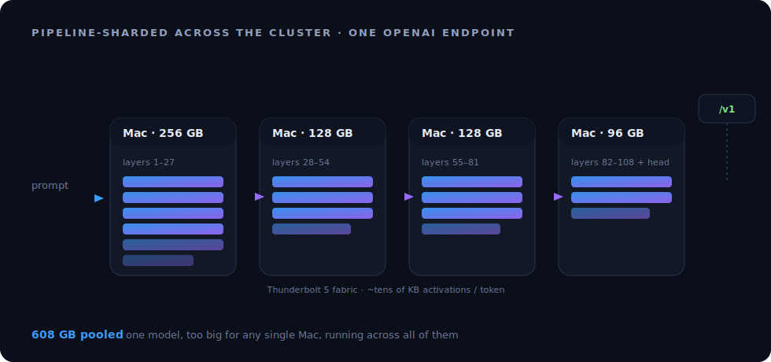

<div align="center">


# mac-ssi

### Turn the Macs you already own into one computer.

**mac-ssi is a Single System Image for Apple Silicon: it fuses the CPU, GPU, Neural Engine, memory, and storage of every Mac you own into one compute fabric — over Thunderbolt 5, Ethernet, or Wi-Fi. Run any workload across all of them, unchanged.**

[](https://github.com/openIE-dev/mac-ssi/releases/latest)
[](#install)
[](https://openie-dev.github.io/mac-ssi/)
[](LICENSE)

[**Website**](https://openie-dev.github.io/mac-ssi/) · [**Quickstart**](#quickstart) · [**Examples**](examples/) · [**API**](#api) · [**How it works**](#how-it-works)

</div>

---

## What it is

You probably own more Macs than you use at once. A Studio under the desk, a MacBook in the bag, an old iMac on the shelf — each idle most of the time, each capped by its own RAM and core count.

**mac-ssi makes them act as one machine.** Memory allocations span every node's RAM; compute dispatches to whichever Mac has idle cores, GPU, or Neural Engine; a process appears as a single PID; one virtual filesystem spans all their disks. No distributed-programming model, no code changes — **unmodified software just sees a bigger computer.**

> Get more out of the hardware you already own. The cluster **is** the computer.

> Reference pool: 4 Macs → **608 GB unified RAM**, 80 CPU cores, ~200 GPU cores, 80 ANE cores, presented as one.

---

## Run anything across the pool

```bash
# Run any binary on the best node — scheduled by free CPU/GPU/ANE/RAM, locality, or energy
ssi run ./render_batch --gpu --min-mem 65536

# Optimize placement for power
ssi run --mode energy ./nightly_job

# See every process across every Mac, as one list
ssi ps
```

Your job sees **aggregate** resources — more RAM than any one Mac has, more cores, more GPU. Rendering, simulation, builds, data processing, batch compute, training — anything that's bottlenecked by a single machine gets the whole pool.

---

## One workload example: large-model inference

Distributed AI inference is one thing the fabric makes easy — a model too big for any single Mac runs across the pool behind one OpenAI-compatible endpoint:

```bash
ssi serve some-large-model --port 8080      # sharded across the cluster's GPU memory
curl http://localhost:8080/v1/chat/completions -d '{"messages":[...]}'   # plain OpenAI API
```

It's *an* application of the fabric, not the point of it. See [`examples/`](examples/) for inference, batch compute, and big-memory jobs.

---

## Quickstart

```bash
# 1. Install on every Mac you want in the pool
brew install --cask openie-dev/mac-ssi/mac-ssi

# 2. Connect them — Thunderbolt 5 (fastest), Ethernet, or just the same Wi-Fi
# 3. Start the agent on each node — they auto-discover each other (mDNS + SWIM)
ssi up

# 4. See your pool as one machine
ssi status
```

```text
  mac-ssi — 4 nodes, 608 GB unified · TB5 + Ethernet fabric
  ───────────────────────────────────────────────────────
  NODE          CHIP         RAM     GPU   LINK    STATUS
  studio-01     M3 Ultra     256 GB  ●●●   TB5     ready
  studio-02     M4 Max        36 GB  ●     TB5     ready
  mbp-01        M4 Max       128 GB  ●●    10GbE   ready
  imac-01       M3            24 GB  ●     Wi-Fi   ready
  ───────────────────────────────────────────────────────
  aggregate: 608 GB · 80 cores · ready for any workload
```

---

## What you can do

| Command | What it does |
|---|---|
| `ssi run ./workload` | Run **any** binary on the best node (or across the pool), scheduled by CPU/GPU/ANE/RAM/locality/energy |
| `ssi ps` · `kill` | One process table across every Mac |
| `ssi memory` | Distributed shared memory — allocate across the pool's combined RAM |
| `ssi gpu` · `ane` | Pool and dispatch to GPU / Neural Engine across nodes |
| `ssi fs` | One virtual filesystem spanning every node's storage |
| `ssi status` · `nodes` · `resources` · `topology` | See the pool — and the fabric links — as one machine |
| `ssi serve <model>` | (example workload) distributed inference → one OpenAI endpoint |

Full reference: **[API & CLI docs →](https://openie-dev.github.io/mac-ssi/#api)**

---

## How it works

Making separate machines act as one is bound by the **interconnect**. Apple's on-die UltraFusion runs at 2.5 TB/s; the link *between* Macs is far slower — 10 GB/s on Thunderbolt 5, less on Ethernet or Wi-Fi. mac-ssi closes that gap in software so the pool behaves like one computer:

- **Predictive page prefetch** (incl. pointer-chase detection) and **write coalescing**
- **Tiered memory** classification — hot pages local, cold pages remote/streamed
- **Locality-aware scheduling** — run work where its data already lives
- **RDMA buffer pooling** and **LZ4 page compression** over the wire
- **Per-region consistency modes** + **MOESI cache coherence** for shared memory

Together these cut effective cross-node latency **10–100×** for real workloads — and the system **adapts to your link**: full RDMA on Thunderbolt 5, plain sockets on Ethernet or Wi-Fi, same single-machine view either way.

<div align="center"></div>

---

## Install

**Homebrew (recommended):**
```bash
brew install --cask openie-dev/mac-ssi/mac-ssi
```

**Direct download:** grab the latest `.dmg` from [**Releases**](https://github.com/openIE-dev/mac-ssi/releases/latest), open it, drag **mac-ssi** to Applications.

Works over **Thunderbolt 5** (RDMA, fastest), **Ethernet**, or **Wi-Fi**. Apple Silicon; macOS 26.2+ unlocks TB5 RDMA (earlier releases run over IP).

---

## Examples

- [`examples/run-anywhere.md`](examples/run-anywhere.md) — run any workload on the best Mac, or across the whole pool
- [`examples/use-cases.md`](examples/use-cases.md) — big-memory jobs, burst compute, render/sim farms, private on-prem AI
- [`examples/serve-openai.md`](examples/serve-openai.md) — the inference example: serve a large model as an OpenAI endpoint

---

## About

mac-ssi is built by [**openIE**](https://openie.dev). The app is distributed as a signed `.dmg`; this repository hosts the website, documentation, examples, and Homebrew cask. The engine source is maintained privately.

**License:** [Apache-2.0](LICENSE) (documentation & examples). · **Contact:** david@openie.dev
